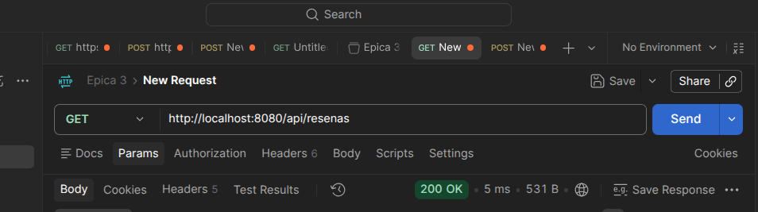
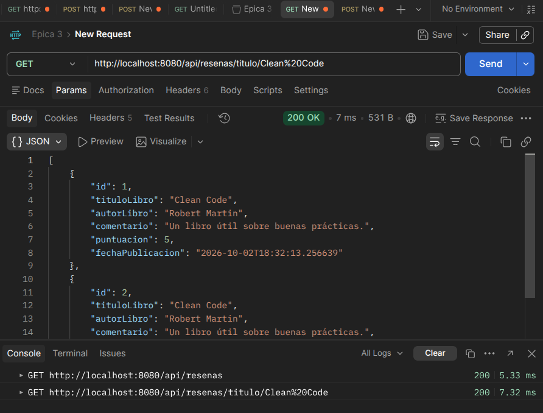
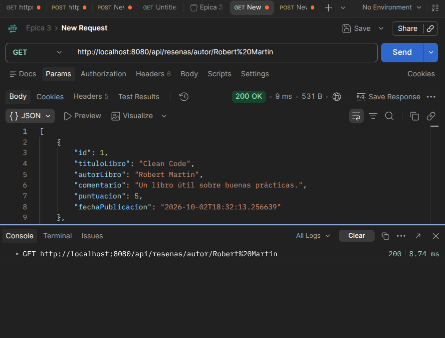
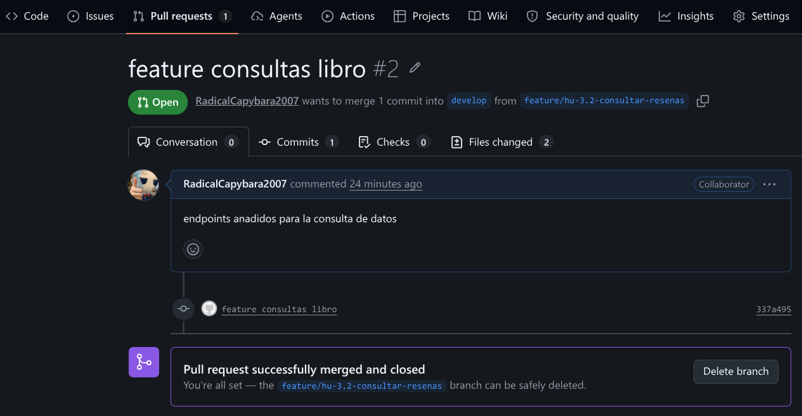

# Práctica: HU 3.1 - Publicar Reseña de Libro (Épica 3)

> **Universidad Tecnológica de Chihuahua (UTCH)**  
> **Asignatura:** Desarrollo Web Integral  
> **Profesor:** Instructor de la Materia  
> **Proyecto:** Implementación de la Historia de Usuario 3.1 (Publicar Reseña de Libro) y Flujo Git Profesional  
> **Entregables:** Repositorio en GitHub con fusión remota de ramas, historia de usuario 3.1, `README.md` y capturas del proceso.

---

## 👥 Integrantes del Equipo y Distribución de Tareas

El desarrollo colaborativo de la **HU 3.1 (Publicar Reseña de Libro)** se dividió entre los integrantes del equipo:

| Integrante | Rol / Responsabilidad | Asignación Específica | Rama Git Asignada |
| :--- | :--- | :--- | :--- |
| **Joel Torres (jt)** | Developer | **Controlador REST y DTOs:** Endpoints HTTP (`POST /api/resenas`), Validaciones (`@Valid`, `@NotBlank`, `@Min`, `@Max`) y DTOs de Request/Response | `feat/jt/publicar-resena-controller` |
| **Diego** | Developer | **Capa de Servicio y Persistencia:** Lógica de negocio (`ResenaLibroService`), entidad JPA (`ResenaLibro`) y repositorio (`ResenaLibroRepository`) | `feat/diego/publicar-resena-service` |
| **Luis** | DevSecOps / Integración | **Fusión Selectiva y Pruebas:** Ejecución de `git cherry-pick` (Captura 7) y Suite de Pruebas Automatizadas con Maven (Captura 8) | `feat/luis/hotfix-cherry-pick` |

---

## 📝 Historia de Usuario 3.1: Publicar Reseña de Libro

### Descripción
* **Como:** Lector
* **Quiero:** Publicar una reseña indicando el título del libro, el nombre del autor, un comentario y una puntuación de 1 a 5 estrellas.
* **Para:** Compartir mi opinión y recomendación con otros lectores de la comunidad.

### Criterios de Aceptación Cumplidos:
1. **Validación de campos obligatorios:** El endpoint `POST /api/resenas` exige los campos `tituloLibro`, `autorLibro`, `comentario` y `puntuacion`.
2. **Validación de puntuación:** Garantiza que la puntuación esté strictly en el rango de 1 a 5 estrellas mediante `@Min(1)` y `@Max(5)`.
3. **Marca de tiempo automática:** Genera la fecha y hora exacta de publicación (`fechaPublicacion`) al momento de guardar.
4. **Respuesta HTTP:** Retorna el código de respuesta HTTP `201 Created` con el objeto DTO conteniendo el `id` autogenerado.

---

## 📝 Historia de Usuario 3.2: Consultar Reseñas de Libros

### Descripción
* **Como:** Visitante de la plataforma.
* **Quiero:** Consultar reseñas y filtrar las opiniones por título o autor del libro.
* **Para:** Conocer las experiencias y calificaciones compartidas por otros lectores.

### Implementación
Se agregó la consulta de reseñas usando Spring Data JPA. El repositorio obtiene todas las reseñas ordenadas desde la más reciente y permite búsquedas parciales, sin distinguir mayúsculas y minúsculas, por título y autor. El servicio convierte los resultados al DTO de respuesta y el controlador los expone con respuestas HTTP `200 OK`.

| Método | Endpoint | Resultado |
| :--- | :--- | :--- |
| `GET` | `/api/resenas` | Consulta todas las reseñas, ordenadas por fecha descendente. |
| `GET` | `/api/resenas/titulo/{tituloLibro}` | Consulta reseñas cuyo título contiene el texto indicado. |
| `GET` | `/api/resenas/autor/{autorLibro}` | Consulta reseñas cuyo autor contiene el texto indicado. |

### Evidencia de la HU 3.2
Guarda las capturas de Postman dentro de la carpeta `screenshots/`, en la raíz del repositorio. Usa estos nombres para mantener las capturas existentes de la HU 3.1:

> **Captura 09:** Consulta de todas las reseñas, mostrando `GET /api/resenas` y la respuesta `200 OK`.
> 

> **Captura 10:** Búsqueda por título, mostrando la URL, el filtro usado y la respuesta `200 OK`.
> 

> **Captura 11:** Búsqueda por autor, mostrando la URL, el filtro usado y la respuesta `200 OK`.
> 

> **Captura 12:** Pull Request de `feature/hu-3.2-consultar-resenas` hacia `develop`, mostrando su fusión realizada en GitHub.
> 

---

## 🔀 Documentación del Flujo de Trabajo Git / GitHub

A continuación se detalla el flujo colaborativo ejecutado por Joel Torres, Diego y Luis.

### Paso 1: Configuración Local de Git (`.gitconfig`)
Cada integrante configuró su identidad local antes de realizar commits:

```bash
git config --global user.name "Joel Torres"
git config --global user.email "joel.torres@utch.edu.mx"
git config --list
```

> **Evidencia:**  
> 

---

### Paso 2: Inicialización del Repositorio y Rama Base (`main` / `develop`)
Se inicializó el repositorio con la estructura Spring Boot y se definieron las ramas principales `main` y `develop`.

```bash
git init
git add .
git commit -m "feat: estructura base Spring Boot para HU 3.1 Publicar Resena"
git branch -M main
git remote add origin https://github.com/JTorresLLL3/epica.git
git push -u origin main

# Creación de rama develop
git checkout -b develop
git push -u origin develop
```

> **Evidencia:**  
> 

---

### Paso 3: Creación de Ramas por Feature
Cada integrante creó su rama de desarrollo basada en `develop` siguiendo la convención acordada:

* **Joel Torres:** `git checkout -b feat/jt/publicar-resena-controller`
* **Diego:** `git checkout -b feat/diego/publicar-resena-service`
* **Luis:** `git checkout -b feat/luis/hotfix-cherry-pick`

```bash
git checkout -b feat/jt/publicar-resena-controller
git branch -a
```

> **Evidencia:**  
> 

---

### Paso 4: Commits Específicos por Tarea
Cada integrante realizó cambios puntuales y commits siguiendo la convención Conventional Commits:

```bash
git add .
git commit -m "feat(resena): implementar ResenaLibroController y DTOs con validaciones para HU 3.1"
git push origin feat/jt/publicar-resena-controller
```

> **Evidencia:**  
> 

---

### Paso 5: Apertura de Pull Requests (PR) en GitHub
En la plataforma GitHub se crearon las Pull Requests de cada rama hacia la rama `develop` para revisión entre pares.

> **Evidencia:**  
> 

---

### Paso 6: Revisión de Código y Fusión Remota (Merge Remote)
Las fusiones de ramas se realizaron exclusivamente en remoto a través de la interfaz de GitHub usando `Merge Pull Request`.

> **Evidencia:**  
> 

---

### Paso 7: Fusión Selectiva de Commits por Luis (`git cherry-pick`)
Para demostrar la integración selectiva de commits entre ramas, **Luis** realizó el proceso de cherry-pick:

1. Creó un commit de ajuste en la rama `feat/luis/hotfix-cherry-pick`.
2. Se aplicó únicamente ese commit hacia `develop` o `main`:

```bash
git checkout develop
git pull origin develop
git cherry-pick <hash_del_commit>
git push origin develop
```

> **Evidencia (Luis):**  
> 

---

### Paso 8: Verificación y Ejecución de Pruebas Automatizadas por Luis
**Luis** ejecutó la suite de pruebas automatizadas en Spring Boot para certificar la estabilidad de la HU 3.1:

```bash
mvn clean test
```

> **Evidencia (Luis):**  
> 

---

## 🛠️ Instrucciones para Ejecutar la Aplicación

1. **Clonar el proyecto:**
   ```bash
   git clone https://github.com/JTorresLLL3/epica.git
   cd epica
   ```
2. **Configurar la Base de Datos PostgreSQL:**
   * Crear la base de datos `resenas_db` en PostgreSQL local.
   * Verificar la contraseña en `src/main/resources/application-dev.properties`.
3. **Ejecutar pruebas:**
   ```bash
   mvn clean test
   ```
4. **Iniciar servidor:**
   ```bash
   mvn spring-boot:run
   ```

---

## 📌 Enlace del Repositorio

* **URL del Repositorio GitHub:** `https://github.com/JTorresLLL3/epica`
