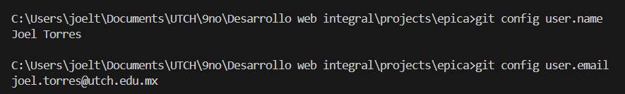
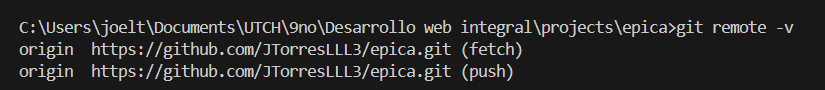
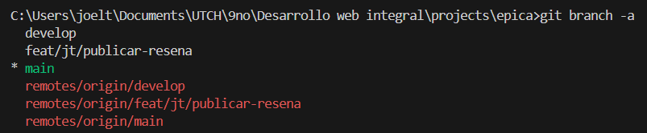
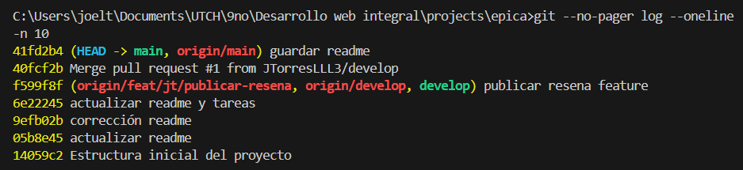
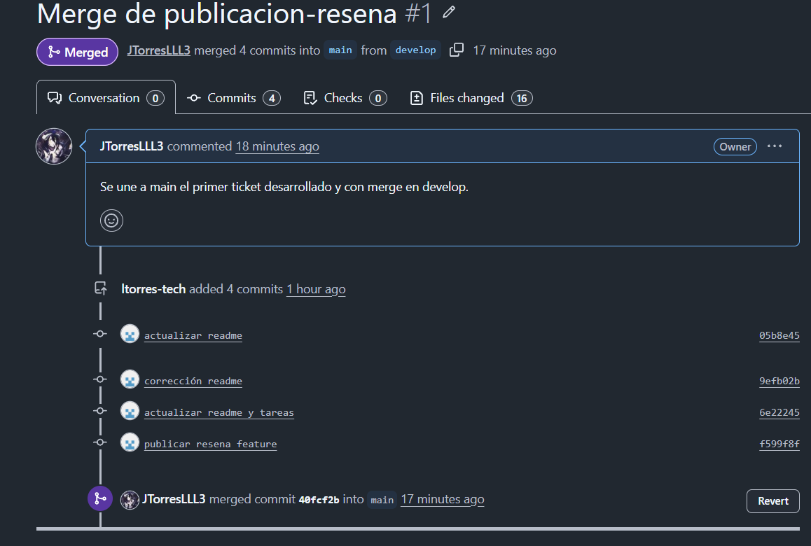
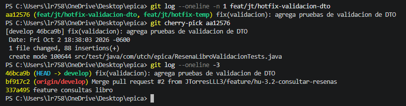
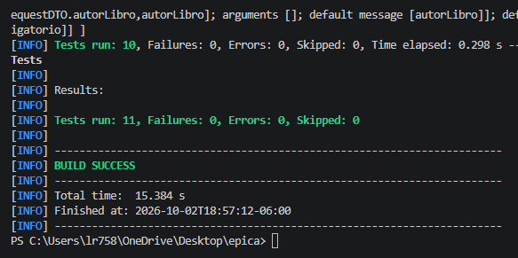

# Práctica: Épica 3 - Plataforma de Reseñas de Libros y Flujo Colaborativo Git / GitHub

> **Universidad Tecnológica de Chihuahua (UTCH)**  
> **Asignatura:** Desarrollo Web Integral  
> **Profesor:** Instructor de la Materia  
> **Proyecto:** Desarrollo de la Épica 3 en Spring Boot y Gestión de Flujo Git Profesional  
> **Entregables:** Repositorio en GitHub con fusión remota de ramas, historias de usuario, `README.md` y capturas del proceso.

---

## 👥 Integrantes del Equipo (2 Personas)

La distribución de tareas para la implementación de la **Épica 3** se dividió de manera equitativa entre los integrantes del equipo:

| Integrante | Rol / Responsabilidad | Asignación Específica | Rama Git Asignada |
| :--- | :--- | :--- | :--- |
| **Joel Torres (jt)** | Developer | **HU 3.1:** Publicar Reseña de Libro (`POST /api/resenas`, DTOs, Controlador y Servicio de Registro) | `feat/jt/publicar-resena` |
| **Diego** | Developer | **HU 3.2:** Consultar Reseñas asociadas a un Libro (`GET /api/resenas`, Filtros por Título/Autor y JPA Repository) | `feat/diego/consultar-resenas` |
| **Integración / Hotfix** | Joel & Diego | Configuración de `.gitconfig`, Pruebas Automatizadas y Fusión Selectiva (`git cherry-pick`) | `feat/jt/hotfix-validacion-puntuacion` |

---

## 📖 Épica 3: Plataforma de Inserción y Consulta de Reseñas de Libros

### Descripción General
Un servicio web backend desarrollado en Spring Boot donde los lectores pueden publicar reseñas y calificaciones de libros leídos, así como consultar las opiniones existentes por título o autor.

* **Tecnologías Utilizadas:** Java 21, Spring Boot 3.2.5, Spring Data JPA, H2 Database (en memoria), Maven.

---

## 📝 Historias de Usuario (HU) y Criterios de Aceptación

### 🔵 HU 3.1: Publicar Reseña de Libro (Joel Torres)
* **Como:** Lector
* **Quiero:** Publicar una reseña indicando el título del libro, el nombre del autor, un comentario y una puntuación de 1 a 5 estrellas.
* **Para:** Compartir mi opinión y recomendación con otros lectores de la comunidad.
* **Criterios de Aceptación:**
  1. El endpoint `POST /api/resenas` valida que los campos `tituloLibro`, `autorLibro`, `comentario` y `puntuacion` sean obligatorios.
  2. Valida que la puntuación esté strictly en el rango de 1 a 5 (`@Min(1)` y `@Max(5)`).
  3. Genera automáticamente la fecha y hora exacta de publicación (`fechaPublicacion`).
  4. Retorna el código de respuesta HTTP `201 Created` con el objeto DTO de la reseña registrada (incluyendo su `id`).

---

### 🔵 HU 3.2: Consultar Reseñas asociadas a un Libro (Diego)
* **Como:** Visitante
* **Quiero:** Consultar las reseñas existentes filtrando por título o autor del libro, o ver el listado completo.
* **Para:** Tomar una decisión informada sobre qué libro leer a continuación.
* **Criterios de Aceptación:**
  1. El endpoint `GET /api/resenas` retorna la lista completa de reseñas registradas.
  2. Permite búsqueda o filtrado mediante parámetros opcionales (`GET /api/resenas?tituloLibro=Cien Años`).
  3. La búsqueda es insensible a mayúsculas/minúsculas y coincide parcialmente (`ILIKE / CONTAINING`).
  4. Retorna el código de respuesta HTTP `200 OK` con un array JSON de las reseñas encontradas.

---

## 🔀 Documentación del Flujo de Trabajo Git / GitHub

A continuación se detalla el flujo colaborativo ejecutado por Joel Torres y Diego.

### Paso 1: Configuración Local de Git (`.gitconfig`)
Cada integrante configuró su identidad local antes de generar commits:

```bash
git config --global user.name "Joel Torres"
git config --global user.email "joel.torres@utch.edu.mx"
git config --list
```

> **Evidencia:**  
> 

---

### Paso 2: Inicialización del Repositorio y Rama Base (`main` / `develop`)
Se inicializó el repositorio con la estructura Spring Boot y se definieron las ramas principales `main` y `develop`.

```bash
git init
git add .
git commit -m "feat: estructura base Spring Boot para Epica 3 de Resenas de Libros"
git branch -M main
git remote add origin https://github.com/usuario/epica-resenas-libros.git
git push -u origin main

# Creación de rama develop
git checkout -b develop
git push -u origin develop
```

> **Evidencia:**  
> 

---

### Paso 3: Creación de Ramas por Feature
Cada integrante creó su rama de desarrollo basada en `develop` siguiendo la convención acordada:

* **Joel Torres:** `git checkout -b feat/jt/publicar-resena`
* **Diego:** `git checkout -b feat/diego/consultar-resenas`
* **Hotfix (Cherry-Pick):** `git checkout -b feat/jt/hotfix-validacion-puntuacion`

```bash
git checkout -b feat/jt/publicar-resena
git branch -a
```

> **Evidencia:**  
> 

---

### Paso 4: Commits Específicos por Tarea
Cada integrante realizó cambios puntuales y commits siguiendo la convención Conventional Commits:

```bash
git add .
git commit -m "feat(resena): implementar ResenaLibroController y DTOs para HU 3.1"
git push origin feat/jt/publicar-resena
```

> **Evidencia:**  
> 

---

### Paso 5: Apertura de Pull Requests (PR) en GitHub
En la plataforma GitHub se crearon las Pull Requests de cada rama hacia la rama `develop` para revisión entre pares.

> **Evidencia:**  
> 

---

### Paso 6: Revisión de Código y Fusión Remota (Merge Remote)
Las fusiones de ramas se realizaron exclusivamente en remoto a través de la interfaz de GitHub usando `Merge Pull Request`.

> **Evidencia:**  
> 

---

### Paso 7: Fusión Selectiva de Commits (`git cherry-pick`)
Para demostrar la integración selectiva de commits entre ramas:

1. Se creó un commit de corrección de validaciones en `feat/jt/hotfix-validacion-puntuacion`.
2. Se aplicó únicamente ese commit hacia `develop` o `main`:

```bash
git checkout develop
git pull origin develop
git cherry-pick <hash_del_commit>
git push origin develop
```

> **Evidencia:**  
> 

---

### Paso 8: Verificación y Ejecución de Pruebas
Se ejecutó la suite de pruebas automatizadas en Spring Boot para certificar la funcionalidad de la Épica 3:

```bash
mvn clean test
```

> **Evidencia:**  
> 

---

## 🛠️ Instrucciones para Ejecutar la Aplicación

1. **Clonar el proyecto:**
   ```bash
   git clone https://github.com/usuario/epica-resenas-libros.git
   cd epica-resenas-libros
   ```
2. **Ejecutar pruebas:**
   ```bash
   mvn clean test
   ```
3. **Iniciar servidor:**
   ```bash
   mvn spring-boot:run
   ```
4. **Acceso a H2 Console:**
   * URL: `http://localhost:8080/h2-console`
   * JDBC URL: `jdbc:h2:mem:epicadb`
   * User: `sa` | Password: *(vacío)*

---

## 📌 Enlace del Repositorio

* **URL del Repositorio GitHub:** `https://github.com/usuario/epica-resenas-libros`
